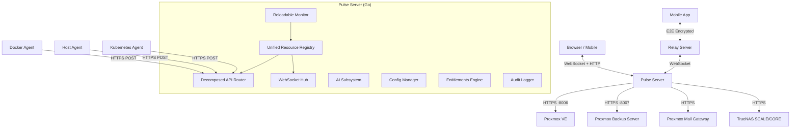

# Pulse Architecture

Pulse is a real-time infrastructure monitoring platform for **Proxmox VE**, **Proxmox Backup Server**, **Proxmox Mail Gateway**, **Docker**, **Host** systems, **Kubernetes**, and **TrueNAS**. It is built with a **Go 1.25+** backend and a **SolidJS / TypeScript** frontend, focusing on low latency, high concurrency, and a premium user experience.

## 🏗 High-Level Overview

The system runs as a single binary that serves both the API and the embedded frontend assets. It connects to infrastructure via platform-specific REST APIs and lightweight push-based agents, normalises everything into a **Unified Resource model**, and delivers real-time updates to clients over WebSocket.

## 🔌 Backend Architecture (Go)

All backend code lives under `cmd/`, `internal/`, and `pkg/`. The binary is assembled from `cmd/pulse/main.go` which delegates to `pkg/server.Run()`.

### Core Components

1. **Entry Point (`cmd/pulse/main.go` → `pkg/server/server.go`)**
   - Loads unified configuration via `internal/config.Load()`.
   - Initialises the RBAC manager (`pkg/auth`), audit logger (`pkg/audit`), and crypto layer (`internal/crypto`).
   - Creates a `ReloadableMonitor` that manages the lifecycle of all monitoring goroutines.
   - Starts the HTTP/HTTPS server, WebSocket hub, AI services (Patrol + Chat), and the Relay client.
   - Supports graceful hot-reload via `SIGHUP` and `.env` file watching.

2. **Unified Resource Registry (`internal/unifiedresources`)**
   - Central data model that normalises resources from **7 data sources** (`proxmox`, `pbs`, `pmg`, `docker`, `agent` (host), `kubernetes`, `truenas`) into a single `Resource` struct.
   - **Resource types**: `host`, `vm`, `lxc`, `container`, `storage`, `k8s_cluster`, `k8s_pod`, `pmg`, `ceph`, `physical_disk`.
   - Identity-matching engine: merges resources across sources using machine IDs, DMI UUIDs, hostnames, IPs, and MAC addresses.
   - Provides typed **views** (`NodeView`, `K8sClusterView`, etc.) for consumer-specific queries.
   - Canonical API endpoint: `GET /api/resources` (replaces deprecated `/api/v2/resources`).

3. **Monitoring Engine (`internal/monitoring`)**
   - **Polymorphic monitors**: Each Proxmox VE/PBS/PMG node runs in its own goroutine, polling via the platform REST API.
   - **Agent receivers** (`internal/api`): Docker, Host, and Kubernetes agents push metrics via HTTP POST to `/api/agents/{type}/report`.
   - **TrueNAS provider** (`internal/truenas`): Polls TrueNAS REST API for system info, pools, datasets, disks, alerts, ZFS snapshots, and replication tasks.
   - Multi-tenant aware: when `PULSE_MULTI_TENANT_ENABLED=true`, each organisation gets an isolated monitor instance with its own configuration.

4. **WebSocket Hub (`internal/websocket`)**
   - Manages active browser connections with per-message compression (deflate).
   - Broadcasts state diffs to all subscribed clients; supports per-tenant broadcasts for multi-org setups.
   - Enforces origin validation, org-level authorization, and multi-tenant license gating.

5. **Decomposed API Router (`internal/api`)**
   - The router is split into focused registration files for maintainability:
     - `router_routes_auth_security.go` — Auth, OIDC, SAML, SSO, security tokens, recovery, agent install scripts.
     - `router_routes_monitoring.go` — Unified resources, metrics history, charts, recovery points, alerts, notifications, discovery.
     - `router_routes_ai_relay.go` — AI settings, Patrol, Intelligence, Chat sessions, Relay config, and the approval workflow.
     - `router_routes_org_license.go` — Organisations, RBAC, audit logs, license/entitlements, billing.
     - `router_routes_registration.go` — Config CRUD, TrueNAS connections, update management, agent profiles, system settings.
     - `router_routes_hosted.go` — Hosted/SaaS-specific signup and org admin routes.
   - Every endpoint enforces **scoped access control** (e.g., `monitoring:read`, `settings:write`, `ai:execute`, `ai:chat`).

6. **Relay Client (`internal/relay`)**
   - Maintains a persistent WebSocket tunnel to a managed relay server for **mobile remote access**.
   - Uses an ECDH key-exchange for per-channel **end-to-end encryption**.
   - Multiplexes multiple mobile sessions over a single connection with back-pressure (data limiter) and per-channel authentication.
   - Supports push notifications through the relay.
   - Gated by the `relay` license feature.

7. **AI Subsystem (`internal/ai`)**
   - **Pulse Assistant (Chat)**: Interactive LLM-powered chat with infrastructure context. Supports bring-your-own-key (BYOK) providers (OpenAI, Anthropic, Ollama, etc.) plus Claude OAuth.
   - **Pulse Patrol**: Scheduled background analysis that produces findings, predictions, and remediation plans. Autonomy levels: `monitor`, `approval`, `assisted`, `full`.
   - **Intelligence Services**: Patterns, correlations, anomalies, baselines, forecasts, and incident recording. All surfaced via `/api/ai/intelligence/*`.
   - **Safety gates**: Command execution disabled by default (`--enable-commands` opt-in); circuit breakers and scoped permissions at every layer.

8. **Entitlements & Licensing (`internal/license`)**
   - Capability-key based gating: `ai_autofix`, `rbac`, `multi_tenant`, `relay`, `agent_profiles`, `kubernetes_ai`, `ai_alerts`, etc.
   - Three tiers: **Community** (free), **Pro** (license key), **Cloud** (subscription).
   - Trial lifecycle with activation, renewal, and expiry. All state exposed via `/api/license/*`.

9. **Recovery Engine (`internal/recovery`)**
   - Aggregates backup data (PBS snapshots, ZFS snapshots, replication tasks) into a unified recovery point timeline.
   - Provides faceted queries: filter by type, source, status. Rollup summaries for dashboards.
   - API: `/api/recovery/points`, `/api/recovery/series`, `/api/recovery/facets`, `/api/recovery/rollups`.

10. **Audit Logging (`pkg/audit`)**
    - Defence-in-depth: every mutation is logged to SQLite, optionally signed with per-tenant encryption keys.
    - Async logging mode (`PULSE_AUDIT_ASYNC`) for high-throughput environments.
    - Tenant-aware logger manager for isolated per-org audit trails.

### Data Flow

1. **Collection**:
   - **Proxmox VE / PBS / PMG**: Monitoring engine polls platform REST APIs (configurable interval, default 2 s for PVE).
   - **Docker / Host / Kubernetes**: Lightweight agents push metrics via HTTP POST on their configured interval.
   - **TrueNAS**: Provider polls the TrueNAS REST API for system, pool, dataset, disk, alert, and replication data.
2. **Normalisation**: Platform-specific responses are mapped into `unifiedresources.Resource` structs by adapters in `internal/unifiedresources/adapters.go`.
3. **Registration**: Resources are inserted into the in-memory registry, which handles deduplication, identity matching, and status computation.
4. **Broadcast**: The latest state snapshot is serialised to JSON and pushed to all connected WebSocket clients by the Hub.
5. **Persistence**: Metrics history is stored in a SQLite-backed metrics store (`pkg/metrics`) with configurable retention.

## 🎨 Frontend Architecture (SolidJS)

The frontend is a modern SPA in `frontend-modern/`, built with **SolidJS** and **TypeScript**. It uses fine-grained reactivity (no Virtual DOM) for maximum performance.

### Key Technologies
- **SolidJS**: Reactive UI framework.
- **TailwindCSS** with a **semantic design token layer**: All structural colours use CSS custom-property tokens (`bg-base`, `bg-surface`, `text-base-content`, `border-border`, etc.) defined in `index.css`— components never hardcode hex values. Light/dark mode switches automatically via class-based theme resolution.
- **Vite**: Build tooling (dev server + production bundling).
- **Lucide Icons**: Icon library (imported as solid components).

### Routing & Navigation

Navigation is organised by **task**, not by platform:

| Route | Page | Purpose |
|---|---|---|
| `/infrastructure` | Infrastructure | Hosts, nodes, clusters across all platforms |
| `/workloads` | Workloads | VMs, LXCs, containers, K8s pods |
| `/storage` | Storage | Proxmox storage, ZFS pools, Ceph |
| `/recovery` | Recovery | Backups, snapshots, replication |
| `/ceph` | Ceph | Detailed Ceph cluster view |
| `/dashboard` | Dashboard | Summary panels and metrics |
| `/alerts/*` | Alerts | Alert rules, active alerts, history |
| `/ai/*` | AI Intelligence | Patrol findings, investigations, forecasts |
| `/settings/*` | Settings | Configuration, security, AI, relay |
| `/operations/*` | Operations | Operational tools |

Legacy routes (`/proxmox`, `/kubernetes`, `/services`, `/hosts`, etc.) are redirected to canonical paths with an informational toast. Redirects can be disabled with `PULSE_DISABLE_LEGACY_ROUTE_REDIRECTS=true`.

### State Management
- **WebSocket store** (`stores/websocket.ts`): Manages the live connection, reactive `State` object, reconnection logic, and per-org switching.
- **Metrics collector** (`stores/metricsCollector.ts`): Buffers time-series data for sparklines and historical charts.
- **AI stores** (`stores/aiChat.ts`, `stores/aiIntelligence.ts`): Manage chat sessions and patrol findings.
- **License store** (`stores/license.ts`): Tracks plan tier, feature flags, and multi-tenant state.
- **System settings store** (`stores/systemSettings.ts`): Caches server-side preferences (e.g., legacy-redirect toggle, theme).

### Component Design
- **Shared primitives** in `components/shared/`: `Card`, `Button`, `Toggle`, `FilterButtonGroup`, `Table` — all mapped to the semantic design tokens.
- **Lazy-loaded pages**: All top-level pages are loaded via `lazy()` with optional preloading after initial render.
- **Virtual table windowing**: Large resource lists use virtualised rendering for smooth scrolling at scale.
- **Command Palette** (`Cmd/Ctrl+K`): Quick-access command launcher.
- **Keyboard shortcuts**: `g i` → Infrastructure, `g w` → Workloads, `g s` → Storage, `g b` → Recovery, `g a` → Alerts, `g t` → Settings, `/` → Search.

### Mobile Experience
- **MobileNavBar** component: Bottom tab bar for touch navigation.
- **Relay integration**: The mobile app connects through the relay protocol for encrypted remote access.

## 🔒 Security

- **Encryption at Rest**: Sensitive config (passwords, API keys) encrypted with AES-GCM via `internal/crypto`. Each tenant can have its own encryption key.
- **Scoped API Tokens**: Tokens carry explicit scopes (`monitoring:read`, `settings:write`, `ai:chat`, `ai:execute`, `docker:report`, etc.). Endpoints enforce scope checks before processing.
- **RBAC**: Role-based access control via `pkg/auth` with file-backed persistence. Resources: `users`, `settings`, `monitoring`.
- **SSO**: OIDC and SAML providers with per-provider configuration and multi-provider support.
- **Agent Commands**: Disabled by default for security. Operators must opt in with `--enable-commands`.
- **Audit Trail**: Every mutation logged to per-tenant SQLite databases with optional cryptographic signatures.
- **Rate Limiting**: Per-endpoint and per-tenant rate limiting with configurable thresholds.
- **CSRF Protection**: Token-based CSRF prevention on mutation endpoints.
- **Recovery Mode**: Localhost-only endpoint for emergency auth recovery with time-limited tokens.

## 🚀 Deployment

Pulse is distributed as:

1. **Docker Container**: Multi-stage build producing a minimal image with the Go binary + embedded frontend.
2. **Single Binary**: The frontend is compiled into the Go binary using `go:embed` (`internal/api/frontend_embed.go`), enabling single-file deployment.
3. **Kubernetes Helm Chart**: For cluster deployments with configurable replicas and persistence.
4. **Systemd Service**: For bare-metal or VM installations with `.env`-based configuration and `SIGHUP` reload support.
5. **Proxmox LXC Helper Script**: One-line install inside a Proxmox helper-scripts container.
