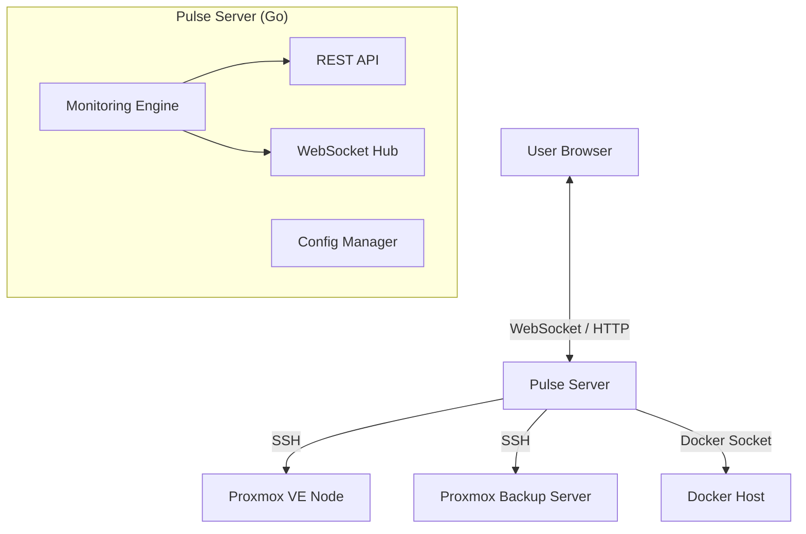

# Pulse Architecture

Pulse is a real-time, agentless (mostly) monitoring system designed for Proxmox VE, Proxmox Backup Server, and Docker infrastructure. It is built with a **Go** backend and a **SolidJS** frontend, focusing on low latency, high concurrency, and a premium user experience.

## 🏗 High-Level Overview

The system operates as a single binary that serves both the API and the static frontend assets. It connects to infrastructure nodes via SSH (for Proxmox) or local/remote Docker sockets to gather metrics, which are then streamed to connected clients via WebSockets.

## 🔌 Backend Architecture (Go)

The backend is a high-performance Go application designed for concurrent monitoring.

### Core Components

1.  **Entry Point (`cmd/pulse/main.go`)**:
    *   Initializes the configuration, logger, and persistence layer.
    *   Starts the `ReloadableMonitor` which manages the lifecycle of monitoring routines.
    *   Launches the HTTP server and WebSocket hub.

2.  **Monitoring Engine (`internal/monitoring`)**:
    *   **Polymorphic Monitors**: Uses interfaces to treat PVE, PBS, and Docker hosts uniformly where possible.
    *   **Goroutines**: Each host is monitored in its own lightweight goroutine to ensure non-blocking operations.
    *   **SSH Connection Pooling**: Maintains persistent SSH connections to Proxmox nodes to avoid handshake overhead during metric collection.

3.  **WebSocket Hub (`internal/websocket`)**:
    *   Manages active client connections.
    *   Broadcasts metric updates in real-time.
    *   Handles "commands" from the frontend (e.g., requesting immediate updates).

4.  **API Layer (`internal/api`)**:
    *   RESTful endpoints for configuration (adding nodes, setting thresholds).
    *   Handles authentication and secure token management.

### Data Flow

1.  **Collection**: The `Monitoring Engine` ticks (default: 2s). It executes commands on remote hosts (e.g., `pvesh`, `docker stats`).
2.  **Normalization**: Raw JSON/Text output is parsed into standardized Go structs (`HostMetrics`, `ContainerMetrics`).
3.  **Broadcast**: Normalized data is sent to the `WebSocket Hub`.
4.  **Delivery**: The Hub serializes the data to JSON and pushes it to all subscribed frontend clients.

## 🎨 Frontend Architecture (SolidJS)

The frontend is a modern Single Page Application (SPA) built with **SolidJS** and **TypeScript**. It prioritizes performance by using fine-grained reactivity instead of a Virtual DOM.

### Key Technologies
*   **SolidJS**: For reactive UI components.
*   **TailwindCSS**: For styling and theming (Dark/Light mode).
*   **Vite**: For fast development and optimized builds.

### State Management
*   **Stores (`frontend-modern/src/stores`)**:
    *   `websocket.ts`: The central nervous system. It maintains the WS connection, handles reconnection logic, and updates reactive signals when new data arrives.
    *   `metricsHistory.ts`: Buffers incoming metrics to drive historical charts (Sparklines) without needing a time-series database backend.

### Component Design
*   **Atomic Design**: Small, reusable components (`MetricBar`, `StatusBadge`) compose into larger views (`NodeSummaryTable`).
*   **Visualizations**: Custom SVG-based charts (Sparklines) are used instead of heavy charting libraries to keep the bundle size small and rendering fast.

## 🔒 Security

*   **Encryption at Rest**: Sensitive configuration (passwords, API keys) is encrypted on disk using `AES-GCM` with a user-provided passphrase.
*   **Transport Security**: All communications can be secured via TLS.
*   **Authentication**: Session-based auth for API access.

## 🚀 Deployment

Pulse is distributed as:
1.  **Docker Container**: Multi-stage build resulting in a scratch-based or alpine-based image containing just the binary and frontend assets.
2.  **Single Binary**: The frontend is embedded into the Go binary using `embed`, allowing for a single-file deployment.
