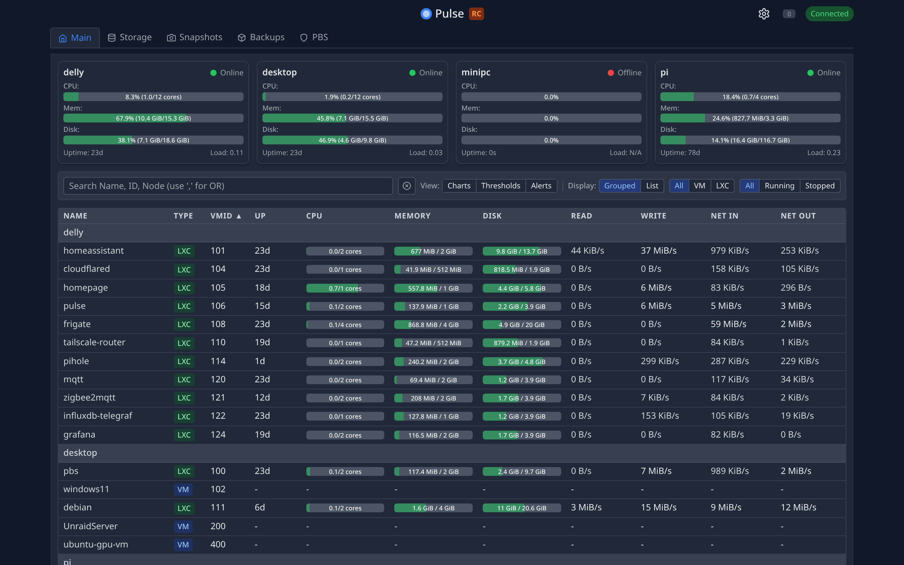

<div align="center">
  
  <h1>Pulse</h1>
  <p><strong>Real-time monitoring for Proxmox VE, Proxmox Mail Gateway, PBS, and Docker infrastructure.</strong></p>

  [](https://github.com/rcourtman/Pulse/releases/latest)
  [](https://hub.docker.com/r/rcourtman/pulse)
  [](LICENSE)
  [](https://github.com/sponsors/rcourtman)

  [Live Demo](https://demo.pulserelay.pro) • [Documentation](docs/README.md) • [Report Bug](https://github.com/rcourtman/Pulse/issues)
</div>

---

## 🚀 Overview

Pulse is a modern, unified dashboard for monitoring your **infrastructure** across Proxmox, Docker, and Kubernetes. It consolidates metrics, alerts, and AI-powered insights from all your systems into a single, beautiful interface.

Designed for homelabs, sysadmins, and MSPs who need a "single pane of glass" without the complexity of enterprise monitoring stacks.



## ✨ Features

### Core Monitoring
- **Unified Monitoring**: View health and metrics for PVE, PBS, PMG, Docker, and Kubernetes in one place
- **Smart Alerts**: Get notified via Discord, Slack, Telegram, Email, and more
- **Auto-Discovery**: Automatically finds Proxmox nodes on your network
- **Metrics History**: Persistent storage with configurable retention
- **Backup Explorer**: Visualize backup jobs and storage usage

### Pulse AI *(New in 5.0)*
- **Chat Assistant**: Ask questions about your infrastructure in natural language
- **Patrol Mode**: Automated health checks with proactive issue detection
- **Auto-Fix**: Automatically resolve common issues with AI-guided remediation
- **Predictive Intelligence**: Forecast problems before they happen

### Multi-Platform
- **Proxmox VE/PBS/PMG**: Full monitoring and management
- **Kubernetes**: Complete K8s cluster monitoring via agents
- **Docker/Podman**: Container and Swarm service monitoring
- **OCI Containers**: Proxmox 9.1+ native container support

### Security & Operations
- **Secure by Design**: Credentials encrypted at rest, strict API scoping
- **One-Click Updates**: Easy upgrades for supported deployments
- **OIDC/SSO**: Enterprise authentication support
- **Privacy Focused**: No telemetry, all data stays on your server

## ⚡ Quick Start

### Option 1: Proxmox LXC (Recommended)
Run this one-liner on your Proxmox host to create a lightweight LXC container:

```bash
curl -fsSL https://github.com/rcourtman/Pulse/releases/latest/download/install.sh | bash
```

### Option 2: Docker
```bash
docker run -d \
  --name pulse \
  -p 7655:7655 \
  -v pulse_data:/data \
  --restart unless-stopped \
  rcourtman/pulse:latest
```

Access the dashboard at `http://<your-ip>:7655`.

## 📚 Documentation

- **[Installation Guide](docs/INSTALL.md)**: Detailed instructions for Docker, Kubernetes, and bare metal.
- **[Configuration](docs/CONFIGURATION.md)**: Setup authentication, notifications, and advanced settings.
- **[Security](SECURITY.md)**: Learn about Pulse's security model and best practices.
- **[API Reference](docs/API.md)**: Integrate Pulse with your own tools.
- **[Architecture](ARCHITECTURE.md)**: High-level system design and data flow.
- **[Troubleshooting](docs/TROUBLESHOOTING.md)**: Solutions to common issues.

## 🌐 Community Integrations

Community-maintained integrations and addons:

- **[Home Assistant Addons](https://github.com/Kosztyk/homeassistant-addons)** - Run Pulse Agent and Pulse Server as Home Assistant addons.

## ❤️ Support Pulse Development

Pulse is maintained by one person. Sponsorships help cover the costs of the demo server, development tools, and domains. If Pulse saves you time, please consider supporting the project!

[](https://github.com/sponsors/rcourtman)
[](https://ko-fi.com/rcourtman)

## 📄 License

MIT © [Richard Courtman](https://github.com/rcourtman)
