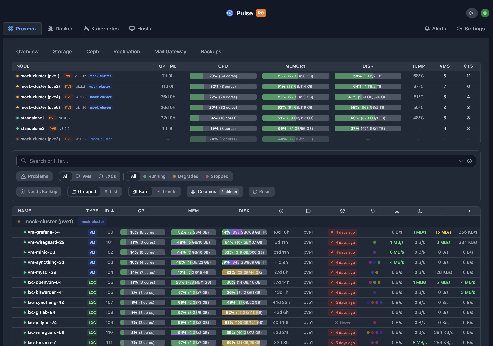

# Pulse

<div align="center">
  
  <p><strong>Real-time monitoring for Proxmox, Docker, Kubernetes, and TrueNAS infrastructure.</strong></p>

  [](https://github.com/rcourtman/Pulse)
  [](https://github.com/rcourtman/Pulse/releases/latest)
  [](https://hub.docker.com/r/rcourtman/pulse)
  [](LICENSE)

  [Live Demo](https://demo.pulserelay.pro) • [Pulse Pro](https://pulserelay.pro) • [Documentation](docs/README.md) • [Report Bug](https://github.com/rcourtman/Pulse/issues)
</div>

---

## 🚀 Overview

Pulse is a modern, unified dashboard for monitoring your **infrastructure** across Proxmox, Docker, Kubernetes, and TrueNAS. It consolidates metrics, alerts, and AI-powered insights from all your systems into a single, beautiful interface.

Designed for homelabs, sysadmins, and MSPs who need a "single pane of glass" without the complexity of enterprise monitoring stacks.



## 🧭 Unified Navigation

Pulse now groups everything by task instead of data source:
- **Infrastructure** for hosts and nodes
- **Workloads** for VMs, containers, and Kubernetes pods
- **Storage** and **Backups** as top-level views
- PMG now routes into **Infrastructure** (source filter), and Kubernetes routes into **Workloads** (K8s filter)
- Legacy `/services` and `/kubernetes` URLs are compatibility redirects; update bookmarks to canonical routes
- Admins can sunset all legacy redirects immediately with `PULSE_DISABLE_LEGACY_ROUTE_REDIRECTS=true` (or `disableLegacyRouteRedirects` in `system.json`)

Power-user shortcuts:
- `g i` → Infrastructure, `g w` → Workloads, `?` → shortcuts help
- `/` or `Cmd/Ctrl+K` → global search

## ✨ Features

### Core Monitoring
- **Unified Monitoring**: View health and metrics for PVE, PBS, PMG, Docker, Kubernetes, and TrueNAS in one place
- **Smart Alerts**: Get notified via Discord, Slack, Telegram, Email, and more
- **Auto-Discovery**: Automatically finds Proxmox nodes on your network
- **Metrics History**: Persistent storage with configurable retention
- **Recovery Central**: Unified backup/snapshot/replication timeline across PBS and TrueNAS

### AI-Powered
- **Chat Assistant (BYOK)**: Ask questions about your infrastructure in natural language
- **Patrol (BYOK)**: Background health checks that generate findings on a schedule
- **Alert Analysis (Pro/Cloud)**: Optional AI analysis when alerts fire
- **Cost Tracking**: Track usage and costs per provider/model

### Multi-Platform
- **Proxmox VE/PBS/PMG**: Full monitoring and management
- **TrueNAS**: Pools, datasets, disks, ZFS snapshots, replication tasks, and alerts
- **Kubernetes**: Complete K8s cluster monitoring via agents
- **Docker/Podman**: Container and Swarm service monitoring
- **OCI Containers**: Proxmox 9.1+ native container support

### Security & Operations
- **Secure by Design**: Credentials encrypted at rest, strict API scoping, agent commands disabled by default
- **One-Click Updates**: Easy upgrades for supported deployments
- **OIDC/SSO/SAML**: Single sign-on with multi-provider support
- **Mobile Remote Access**: Relay protocol with end-to-end encryption for mobile app connectivity (Pro)
- **Privacy Focused**: No outbound telemetry by default. Monitoring data stays on your server.

## ⚡ Quick Start

### Option 1: Proxmox LXC (Recommended)
Run this one-liner on your Proxmox host to create a lightweight LXC container:

```bash
curl -fsSL https://github.com/rcourtman/Pulse/releases/latest/download/install.sh | bash
```

Note: this installs the Pulse **server**. Agent installs use the command generated in **Settings → Unified Agents → Installation commands** (served from `/install.sh` on your Pulse server).

### Option 2: Docker
```bash
docker run -d \
  --name pulse \
  -p 7655:7655 \
  -v pulse_data:/data \
  --restart unless-stopped \
  rcourtman/pulse:latest
```

Access the dashboard at `http://<your-ip>:7655`.

## 📚 Documentation

- **[Installation Guide](docs/INSTALL.md)**: Detailed instructions for Docker, Kubernetes, and bare metal.
- **[Upgrade to v6](docs/UPGRADE_v6.md)**: Migration guide for upgrading from v5 to v6.
- **[Configuration](docs/CONFIGURATION.md)**: Setup authentication, notifications, and advanced settings.
- **[Security](SECURITY.md)**: Learn about Pulse's security model and best practices.
- **[API Reference](docs/API.md)**: Integrate Pulse with your own tools.
- **[Architecture](ARCHITECTURE.md)**: High-level system design and data flow.
- **[AI Features](docs/AI.md)**: Pulse Assistant (Chat) and Pulse Patrol documentation.
- **[Multi-Tenant](docs/MULTI_TENANT.md)**: Enterprise multi-tenant setup and configuration.
- **[Troubleshooting](docs/TROUBLESHOOTING.md)**: Solutions to common issues.
- **[Agent Security](docs/AGENT_SECURITY.md)**: Details on checksum-verified updates and verification.
- **[Docker Monitoring](docs/DOCKER.md)**: Setup and management of Docker agents.
- **[Unified Navigation](docs/MIGRATION_UNIFIED_NAV.md)**: Guide to the new task-based navigation.

## 🌐 Community Integrations

Community-maintained integrations and addons:

- **[Home Assistant Addons](https://github.com/Kosztyk/homeassistant-addons)** - Run Pulse Agent and Pulse Server as Home Assistant addons.

## 💳 Plans (Community / Pro / Cloud)

Pulse is full-featured for core monitoring in every tier. Paid tiers unlock additional capabilities (and Cloud removes hosting/AI setup friction).

**Community** is free and self-hosted. **Pro** is a paid, self-hosted license. **Cloud** is the hosted plan and includes Pro capabilities.

The table below is derived from the canonical entitlement source of truth: `docs/architecture/ENTITLEMENT_MATRIX.md`.

| Capability | Community | Pro | Cloud |
|---|:---:|:---:|:---:|
| Pulse Patrol (Background Health Checks) | ✅ | ✅ | ✅ |
| Alert Analysis | — | ✅ | ✅ |
| Pulse Patrol Auto-Fix | — | ✅ | ✅ |
| Kubernetes Analysis | — | ✅ | ✅ |
| Centralized Agent Profiles | — | ✅ | ✅ |
| Update Alerts (Container/Package Updates) | ✅ | ✅ | ✅ |
| Basic SSO (OIDC) | ✅ | ✅ | ✅ |
| Advanced SSO (SAML/Multi-Provider) | — | ✅ | ✅ |
| Role-Based Access Control (RBAC) | — | ✅ | ✅ |
| Enterprise Audit Logging | — | ✅ | ✅ |
| Advanced Infrastructure Reporting (PDF/CSV) | — | ✅ | ✅ |
| 90-Day Metric History | — | ✅ | ✅ |
| Remote Access (Mobile Relay) | — | ✅ | ✅ |

Pulse Patrol runs on your schedule (every 10 minutes to every 7 days, default 6 hours) and finds:
- ZFS pools approaching capacity
- Backup jobs that silently failed
- VMs stuck in restart loops
- Clock drift across cluster nodes
- Container health check failures

On self-hosted installs, Pulse Patrol uses your configured provider (BYOK) and runs entirely on your server.

Technical highlights:
- Cross-system context (nodes, VMs, backups, containers, and metrics history)
- LLM analysis with your provider + alert-triggered deep dives (Pro/Cloud)
- Optional auto-fix with command safety policies and audit trail
- Centralized agent profiles for consistent fleet settings

**[Try the live demo →](https://demo.pulserelay.pro)** or **[learn more at pulserelay.pro](https://pulserelay.pro)**

Pulse Pro technical details: [docs/PULSE_PRO.md](docs/PULSE_PRO.md)

## ❤️ Support Pulse Development

Pulse is maintained by one person. Sponsorships help cover the costs of the demo server, development tools, and domains. If Pulse saves you time, please consider supporting the project!

[](https://github.com/sponsors/rcourtman)
[](https://ko-fi.com/rcourtman)

## 📄 License

MIT © [Richard Courtman](https://github.com/rcourtman). Use of Pulse Pro is subject to the [Terms of Service](TERMS.md).
