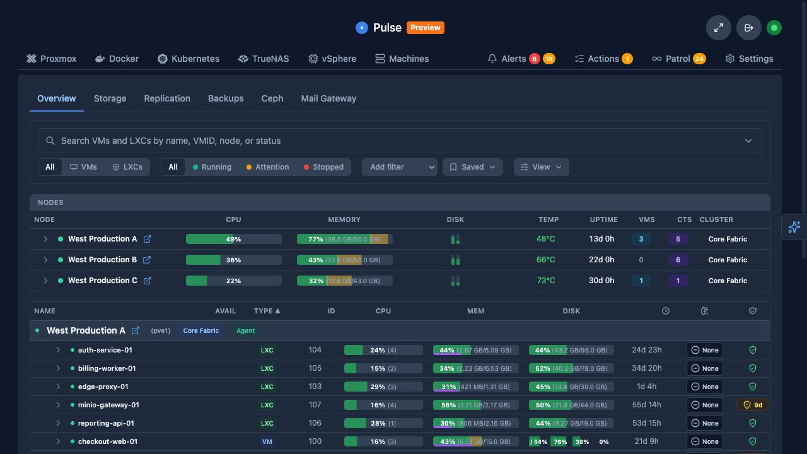
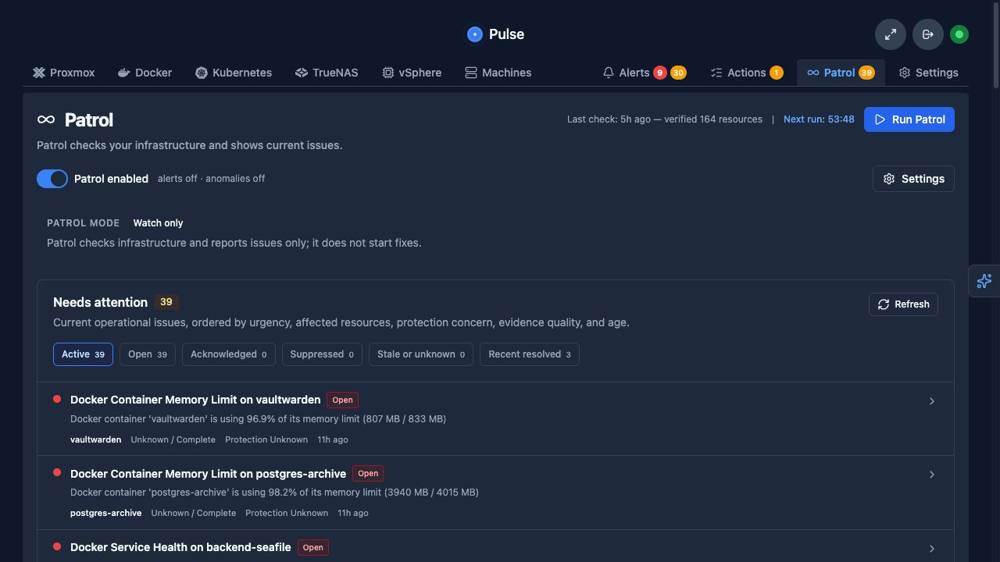

# Pulse

<div align="center">
  
  <p><strong>Infrastructure monitoring that finds what needs attention.</strong></p>

  [](https://github.com/rcourtman/Pulse)
  [](https://github.com/rcourtman/Pulse/releases/latest)
  [](https://hub.docker.com/r/rcourtman/pulse)
  [](LICENSE)

  [Live demo](https://demo.pulserelay.pro) · [Documentation](docs/README.md) · [Releases](https://github.com/rcourtman/Pulse/releases) · [Discussions](https://github.com/rcourtman/Pulse/discussions)
</div>

Pulse is a self-hosted monitoring workspace for Proxmox, Docker, Kubernetes,
TrueNAS, physical and virtual machines, and early-access VMware vSphere
environments. It combines live infrastructure state, history, alerts, recovery
visibility, and scheduled health checks without requiring a conventional
enterprise monitoring stack.



## Why Pulse

- **It watches between visits.** Alerts and Pulse Patrol find failed backups,
  capacity pressure, restart loops, unhealthy containers, clock drift, and
  other problems that dashboards cannot surface when nobody is looking.
- **It keeps each platform familiar.** Proxmox, Docker, Kubernetes, TrueNAS,
  vSphere, and machines have dedicated views, backed by one shared resource
  model for search, alerts, history, and investigation.
- **It stays operator-controlled.** Credentials are encrypted at rest, API
  tokens are scoped, agent commands are disabled by default, and governed fixes
  require the configured policy and approval path.

## Platform coverage

| Platform | Coverage |
|---|---|
| Proxmox VE, PBS, and PMG | Nodes, guests, storage, backups, replication, Ceph, mail gateways, and alerts |
| Docker and Podman | Hosts, containers, Compose projects, Swarm services, health, images, and updates |
| Kubernetes | Clusters, nodes, workloads, pods, services, storage, and events through the unified agent |
| TrueNAS SCALE and CORE | Pools, datasets, disks, snapshots, replication tasks, apps, VMs, and alerts |
| Linux, Windows, and macOS machines | Host health, filesystems, networking, temperatures, RAID, and availability through the unified agent |
| VMware vSphere | Early-access inventory, hosts, clusters, VMs, datastores, networks, snapshots, and recovery context; validate against your own vCenter before production use |

Platform pages keep storage and recovery information beside the infrastructure
it belongs to. Alerts, Actions, and Patrol remain cross-platform views.

## Patrol: monitoring that does rounds

Pulse Patrol runs scheduled checks across the current state and recent history
of your infrastructure. Community installations can use a local model or their
own AI provider for watch-only analysis. Pulse Pro adds investigation and
policy-bound fixes with approval, verification, and an audit trail.



Pulse also includes an interactive Assistant and an MCP adapter for external
clients such as Claude Code and OpenCode. Both sit on top of the same scoped
inventory, metrics, alert, storage, and governed-action contracts.

## Quick start

Choose an exact version from the [latest release](https://github.com/rcourtman/Pulse/releases/latest)
and keep that version pinned during installation.

### Docker

```bash
docker run -d \
  --name pulse \
  -p 7655:7655 \
  -v pulse_data:/data \
  -e PULSE_DEPLOYMENT_METHOD=docker_run \
  --restart unless-stopped \
  rcourtman/pulse:vX.Y.Z
```

Open `http://<your-ip>:7655` and follow the bootstrap-token setup. Docker host
monitoring is provided by the unified agent; the Pulse server container does
not need the Docker socket.

### Proxmox LXC, Linux, and Kubernetes

- [Signed Proxmox LXC and Linux installation](docs/INSTALL.md#quick-start-recommended)
- [Docker Compose](docs/INSTALL.md#docker-compose)
- [Kubernetes and Helm](docs/KUBERNETES.md)

The installer is signed. Verify `install.sh` against the pinned
`pulse-installer` key before running it:

```bash
export PULSE_VERSION=vX.Y.Z
curl -fsSLO "https://github.com/rcourtman/Pulse/releases/download/${PULSE_VERSION}/install.sh"
curl -fsSLO "https://github.com/rcourtman/Pulse/releases/download/${PULSE_VERSION}/install.sh.sshsig"
ssh-keygen -Y verify \
  -f <(printf '%s\n' 'pulse-installer namespaces="pulse-install" ssh-ed25519 AAAAC3NzaC1lZDI1NTE5AAAAIMZd/DaH+BldzOkq1A8KVTcFk73nAyrE8aJOyf7i00jm pulse-installer') \
  -I pulse-installer \
  -n pulse-install \
  -s install.sh.sshsig < install.sh
bash install.sh --version "${PULSE_VERSION}"
rm -f install.sh install.sh.sshsig
```

The GitHub installer installs the Pulse server. Install and upgrade agents
(including v5-to-v6 agent upgrades) with the per-host command generated under
**Settings → Infrastructure → Install on a host**.

> [!IMPORTANT]
> GitHub release assets and `rcourtman/pulse` images are Community builds.
> Relay, Pro, and eligible legacy customers should use the private image or
> Linux archive provided by the [Pulse download portal](https://pulserelay.pro/download.html).
> Replacing a private Pro runtime with a public Community build removes its
> private runtime hooks.

## Editions

- **Community** — self-hosted monitoring, seven days of metric history, core
  SSO, update alerts, and Patrol with your own provider or local model.
- **Relay** — Community plus secure remote web access, Pulse Mobile pairing,
  push notifications, and fourteen days of history.
- **Pro** — Relay plus Patrol investigation, governed fixes, ninety days of
  history, centralized agent profiles, RBAC, audit logging, and reporting.
- **MSP** — for managed service providers: one Pulse Account running many
  client workspaces, each with an isolated Pulse runtime — separate
  dashboards, alerts, users, audit history, and reports. Free sixty-day
  two-client evaluation at [Pulse for MSPs](https://pulserelay.pro/msp.html).

Core self-hosted monitoring is not gated by monitored-system or child-resource
volume. See the [runtime-aligned capability reference](docs/PULSE_PRO.md) and
[current plans](https://pulserelay.pro) for details.

## Documentation

- [Install and deployment](docs/INSTALL.md)
- [Upgrade from Pulse v5](docs/UPGRADE_v6.md)
- [Configuration](docs/CONFIGURATION.md)
- [Platform and agent guides](docs/README.md#platforms-and-agents)
- [Pulse Intelligence](docs/AI.md)
- [Security](SECURITY.md) and [privacy](docs/PRIVACY.md)
- [Code signing policy](docs/CODE_SIGNING_POLICY.md)
- [Troubleshooting](docs/TROUBLESHOOTING.md)
- [API reference](docs/API.md) and [architecture](ARCHITECTURE.md)

Localized getting started guides:
[Deutsch](docs/i18n/de/README.md) · [Español](docs/i18n/es/README.md)

## Development

Pulse uses Go 1.26 and a SolidJS/TypeScript frontend. The managed development
runtime starts the frontend at `http://127.0.0.1:5173` and proxies API and
WebSocket traffic to the backend on port `7655`.

```bash
npm ci
npm --prefix frontend-modern ci
npm run dev
```

Useful checks:

```bash
go test ./...
npm --prefix frontend-modern test
npm --prefix frontend-modern run type-check
python3 scripts/check_public_docs.py
```

See [CONTRIBUTING.md](CONTRIBUTING.md) before investing in a code change. Pulse
uses an issue-first contribution process and does not normally accept
unsolicited pull requests.

## Community and support

- Ask questions in [GitHub Discussions](https://github.com/rcourtman/Pulse/discussions).
- Report reproducible bugs through [GitHub Issues](https://github.com/rcourtman/Pulse/issues).
- Home Assistant users can use the community-maintained
  [Pulse add-ons](https://github.com/Kosztyk/homeassistant-addons).
- If Pulse is useful to you, support its development through
  [GitHub Sponsors](https://github.com/sponsors/rcourtman) or
  [Ko-fi](https://ko-fi.com/rcourtman).

## License

Pulse Community is available under the [MIT License](LICENSE). Pulse Pro is
subject to the [Terms of Service](TERMS.md).
