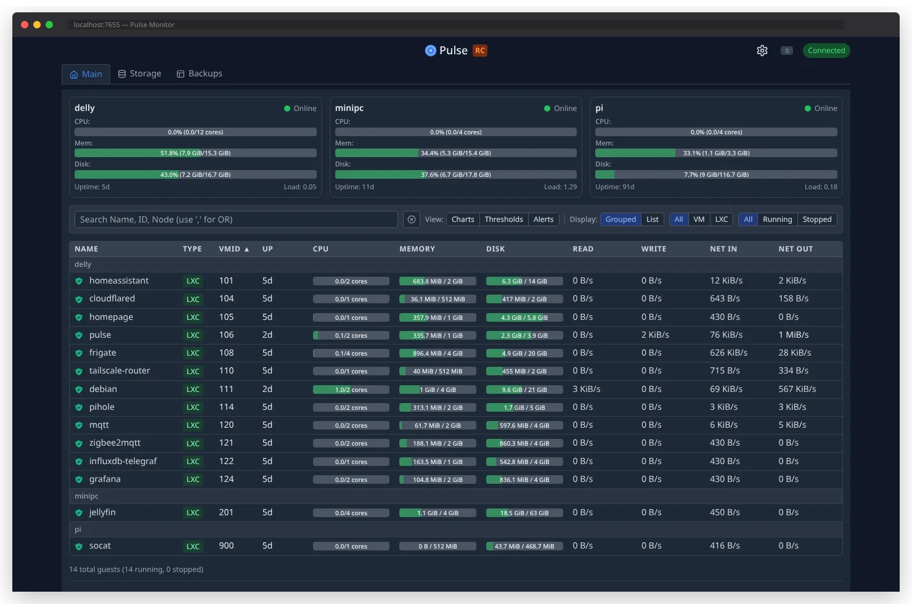

#  Pulse for Proxmox

[](https://github.com/rcourtman/Pulse/releases/latest)
[](https://hub.docker.com/r/rcourtman/pulse)
[](LICENSE)

**Real-time monitoring for Proxmox VE and PBS with alerts, webhooks, and a clean web interface.**



## Key Features

- **Real-time Monitoring** - Live updates for VMs, containers, and storage via WebSockets
- **Smart Alerts** - Configurable thresholds with email and webhook notifications (Discord, Slack, Teams)
- **Unified Backups** - Single view for PBS backups, PVE backups, and snapshots
- **PBS Push Mode** - Monitor isolated/firewalled PBS servers without inbound connections
- **Modern UI** - Responsive design with dark/light themes and virtual scrolling
- **Lightweight** - Minimal resource usage, stops polling when no clients connected

[View Screenshots →](docs/SCREENSHOTS.md)

## Quick Start (2 minutes)

### Prerequisites
- Proxmox VE 7.0+ or PBS 2.0+
- Network access to Proxmox API (ports 8006/8007)

### Install Pulse

Choose **one** method:

```bash
# Option A: Automated LXC Container (Easiest)
bash -c "$(wget -qLO - https://github.com/community-scripts/ProxmoxVE/raw/main/ct/pulse.sh)"

# Option B: Docker (For existing Docker hosts)
docker run -d -p 7655:7655 -v pulse_config:/config -v pulse_data:/data rcourtman/pulse:latest

# Option C: Manual Install (For existing LXC/VMs)
curl -fsSL https://raw.githubusercontent.com/rcourtman/Pulse/main/scripts/install-pulse.sh | sudo bash
```

### Configure

1. Open `http://<pulse-ip>:7655` in your browser
2. The settings modal will open automatically
3. Add your Proxmox connection:
   - **URL**: `https://your-proxmox:8006`
   - **Token ID**: `user@pam!token` (see [Creating API Token](#creating-api-token))
   - **Token Secret**: Your token secret
4. Click "Test Connection" → "Save"

**That's it!** Pulse is now monitoring your Proxmox environment.

## Creating API Token

<details>
<summary><strong>Proxmox VE Token (Click to expand)</strong></summary>

1. In Proxmox web UI: **Datacenter → Permissions → API Tokens → Add**
2. Select user (or create new one like `pulse@pam`)
3. Token ID: `pulse`
4. **Uncheck "Privilege Separation"** (important!)
5. Copy the secret immediately (shown only once)
6. **Grant permissions**: Datacenter → Permissions → Add → User Permission
   - Path: `/`
   - User: `pulse@pam` (not the token!)
   - Role: `PVEAuditor`
   - Propagate: Checked

For backup visibility, also add:
   - Path: `/storage`
   - Role: `PVEDatastoreAdmin`

</details>

<details>
<summary><strong>PBS Token (Click to expand)</strong></summary>

```bash
# Quick setup (run on PBS):
proxmox-backup-manager user create pulse@pbs --password 'TempPass123'
proxmox-backup-manager user generate-token pulse@pbs monitoring
proxmox-backup-manager acl update /datastore DatastoreAudit --auth-id 'pulse@pbs!monitoring'
```

</details>

## Configuration

All configuration is done through the web interface - no file editing required!

- **Settings** (gear icon) - Add/modify Proxmox connections, configure alerts
- **Alerts** - Set CPU/Memory/Disk thresholds, configure notifications
- **Updates** - Built-in updater for non-Docker installations

For advanced configuration options, see [Configuration Guide](docs/CONFIGURATION.md).

## Documentation

- [Installation Guide](docs/INSTALLATION.md) - Detailed install instructions for all methods
- [Configuration Guide](docs/CONFIGURATION.md) - Advanced settings and environment variables
- [PBS Push Mode](docs/PBS_PUSH_MODE.md) - Monitor isolated PBS servers
- [Troubleshooting](docs/TROUBLESHOOTING.md) - Common issues and solutions

## Common Issues

### Empty Dashboard?
Run diagnostics: `http://<pulse-ip>:7655/diagnostics.html`

Most common cause: Missing API token permissions. The diagnostic tool will tell you exactly what's wrong.

### Can't see backups?
- **PVE Backups**: Need `PVEDatastoreAdmin` role on `/storage`
- **PBS Backups**: Configure PBS connection in settings

### Update Issues?
- **LXC/Manual**: Click update button in settings or run `sudo /opt/pulse/scripts/install-pulse.sh --update`
- **Docker**: Run `docker compose pull && docker compose up -d`

[Full Troubleshooting Guide →](docs/TROUBLESHOOTING.md)

## Choosing Installation Method

| Method | Best For | Pros | Cons |
|--------|----------|------|------|
| **Community Scripts** | New users, dedicated monitoring | Automated setup, includes dependencies | Creates new LXC |
| **Docker** | Existing Docker hosts | Easy updates, isolated | No built-in updater |
| **Manual** | Existing LXC/VMs | Use existing system | Manual dependency install |

## Updating

- **Web UI**: Settings → Software Updates → Check for Updates
- **Docker**: `docker compose pull && docker compose up -d`
- **Manual**: `sudo /opt/pulse/scripts/install-pulse.sh --update`

## Contributing

We welcome contributions! See [Contributing Guidelines](CONTRIBUTING.md).

- `main` branch: Stable releases only
- `develop` branch: Active development (auto-creates RC releases)

## License

MIT License - see [LICENSE](LICENSE) file.

## Trademark Notice

Proxmox® is a registered trademark of Proxmox Server Solutions GmbH. This project is not affiliated with or endorsed by Proxmox Server Solutions GmbH.

## Support

If you find Pulse useful, consider supporting development:

[](https://ko-fi.com/rcourtman)

---

<p align="center">
  <a href="https://github.com/rcourtman/Pulse/issues">Report Bug</a> •
  <a href="https://github.com/rcourtman/Pulse/issues">Request Feature</a> •
  <a href="https://docs.anthropic.com/en/docs/claude-code">Built with Claude Code</a>
</p>