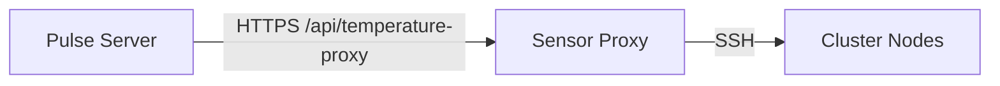

# 📡 Proxy Control Plane

The Control Plane synchronizes `pulse-sensor-proxy` instances with the Pulse server, ensuring they trust the correct nodes without manual configuration.

> **Deprecated in v5:** `pulse-sensor-proxy` (and its control-plane sync) is deprecated and not recommended for new deployments. New installs should use `pulse-agent --enable-proxmox` for temperature monitoring.

> **Important**: The control-plane endpoints are disabled by default. Set `PULSE_ENABLE_SENSOR_PROXY=true` on the Pulse server to enable legacy proxy support.

## 🏗️ Architecture



1.  **Registration**: The proxy registers with Pulse on startup/install.
2.  **Sync**: The proxy periodically fetches the "Authorized Nodes" list from Pulse.
3.  **Validation**: The proxy only executes commands on nodes authorized by Pulse.

## 🔄 Workflow

1.  **Install**: `install-sensor-proxy.sh` calls `/api/temperature-proxy/register`.
2.  **Token Exchange**: Pulse returns a control-plane token which the proxy saves to `/etc/pulse-sensor-proxy/.pulse-control-token`.
3.  **Polling**: The proxy polls `/api/temperature-proxy/authorized-nodes` every 60s (configurable).
4.  **Update**: If the node list changes (e.g., a new node is added to Pulse), the proxy updates its internal allowlist automatically.

## ⚙️ Configuration

The proxy configuration in `/etc/pulse-sensor-proxy/config.yaml` handles the sync:

```yaml
pulse_control_plane:
  url: https://pulse.example.com:7655
  token_file: /etc/pulse-sensor-proxy/.pulse-control-token
  refresh_interval: 60
```

## 🛡️ Security

*   **Tokens**: The control-plane token is unique per proxy instance.
*   **Least Privilege**: The proxy only knows about nodes explicitly added to Pulse.
*   **Fallback**: If the control plane is unreachable, the proxy uses its last known good configuration.
