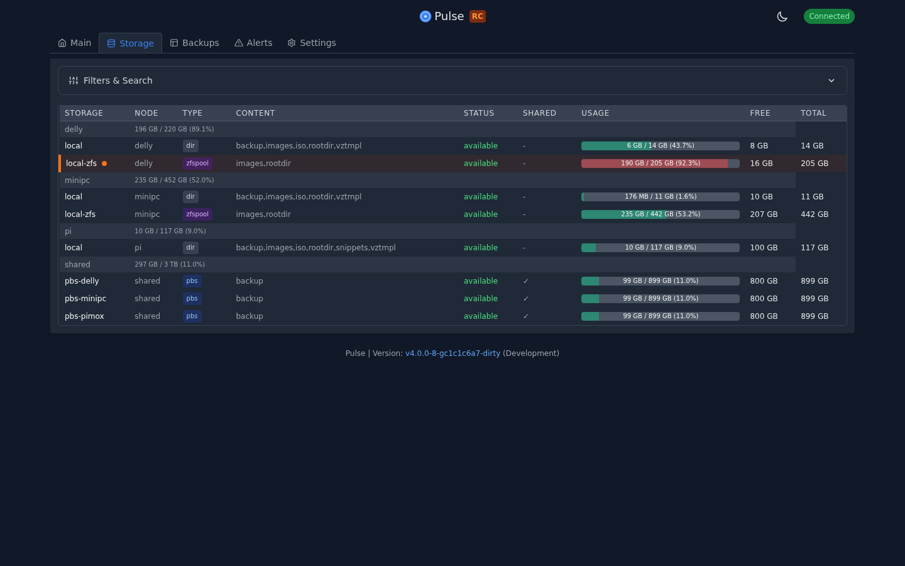
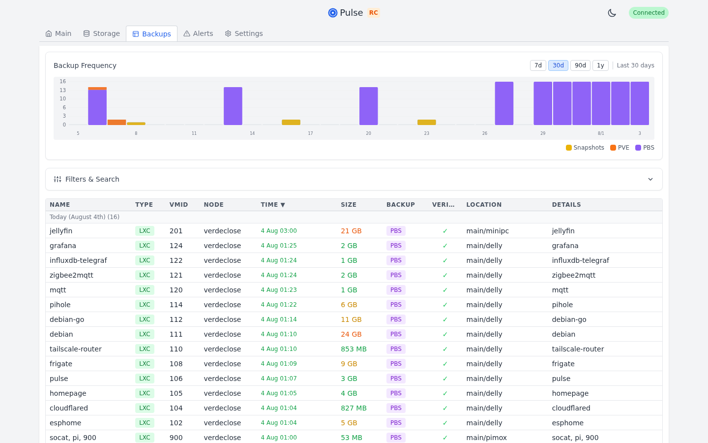
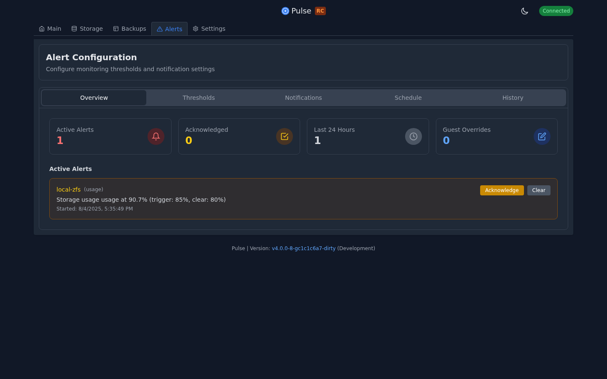
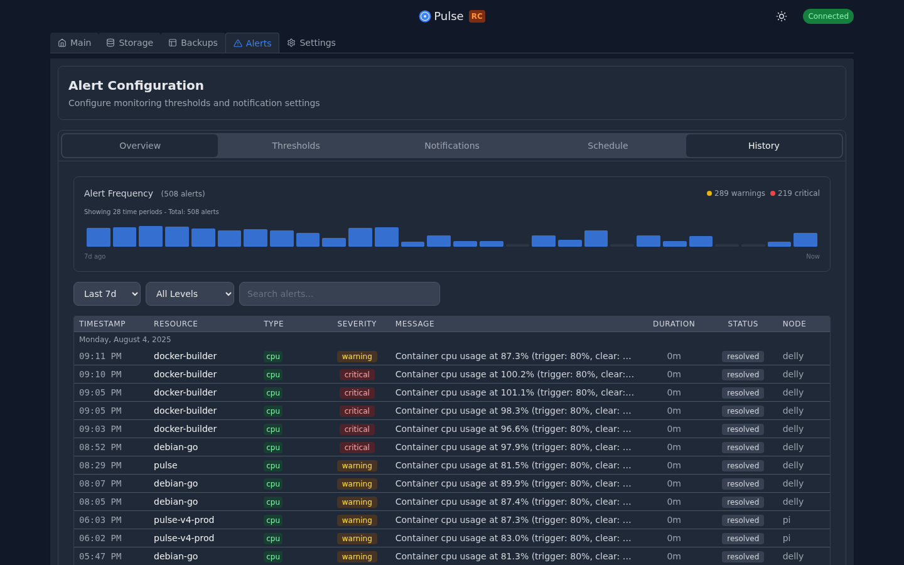
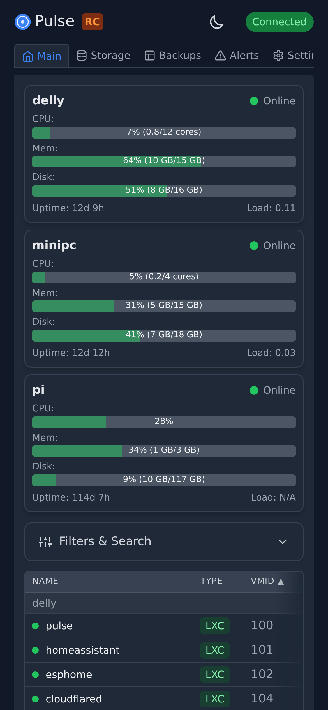

# Pulse Screenshots

## Dashboard Overview (Dark Mode)

*Real-time monitoring dashboard showing 7 Proxmox nodes with 35 VMs and 56 containers. Color-coded resource usage (CPU, RAM, storage) with quick status indicators for running/stopped guests. Automatic layout adapts to cluster size - compact cards for 5-9 nodes. Professional dark theme optimized for 24/7 monitoring setups.*

## Storage Management

*Comprehensive storage view displaying all storage pools across nodes with usage percentages, allocated vs used space, and visual indicators. Monitors local, ZFS, LVM, and network storage types in a unified interface.*

## Backup Central

*Centralized backup management showing PBS backups, PVE backup tasks, and VM snapshots in one place. Track backup status, sizes, retention, and quickly identify failed or missing backups across your entire infrastructure. Time-range buttons (24h/7d/30d/custom) and the synchronized bar chart make it easy to focus on exactly the window you care about.*

## Alerts & Configuration

*Unified alerts view showing active alerts and configuration settings. Monitor current system alerts with severity indicators, affected resources, and acknowledgment status. Configure thresholds, notification settings, quiet hours, and alert grouping. Bulk actions allow managing multiple alerts simultaneously.*

## Alert History & Analytics

*Comprehensive alert history with frequency visualization showing 77 alerts over 28 time periods. Filter by severity (warnings, critical, info), search specific resources, and track resolution times. Visual timeline helps identify patterns and recurring issues.*

## Settings & Node Management

*Manage Proxmox nodes and PBS instances through the UI. Add/remove nodes, configure credentials securely (encrypted at rest), set polling intervals, and manage authentication settings. Quick health check shows connection status for all nodes.*

## Mobile Responsive Design

*Fully responsive mobile interface for monitoring on the go. Touch-optimized controls, collapsible navigation, and adaptive layouts ensure full functionality on smartphones and tablets without compromising usability.*
