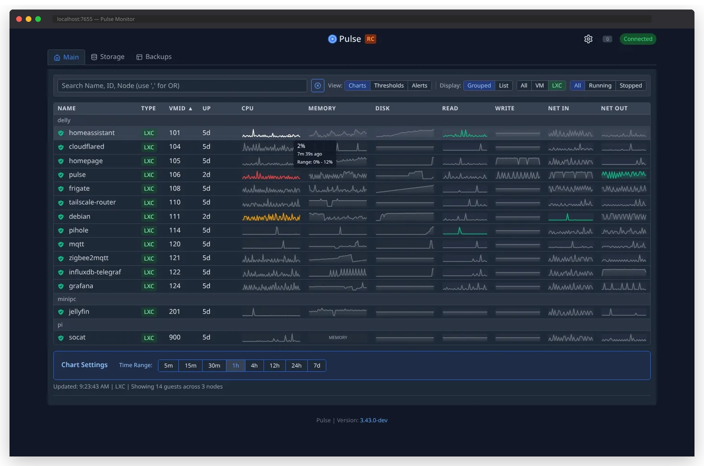

# Pulse Screenshots

## Dashboard Views

### Main Dashboard
Real-time monitoring of all VMs and containers with resource usage indicators.

### Storage Overview
Comprehensive view of storage usage across all configured Proxmox nodes.

### Unified Backup Management
All backups in one place - PBS backups, PVE backups, and snapshots.

## Monitoring Features

### Real-time Performance Charts
Live CPU, memory, and network usage charts for each VM/container.

### Alert Configuration
Set custom thresholds and configure notifications for proactive monitoring.

## Key Visual Features

- **Color-coded status indicators** - Quick visual health assessment
- **Responsive design** - Works on desktop and mobile devices
- **Dark/Light themes** - Automatic or manual theme switching
- **Virtual scrolling** - Handle hundreds of VMs smoothly
- **Real-time updates** - No page refreshes needed