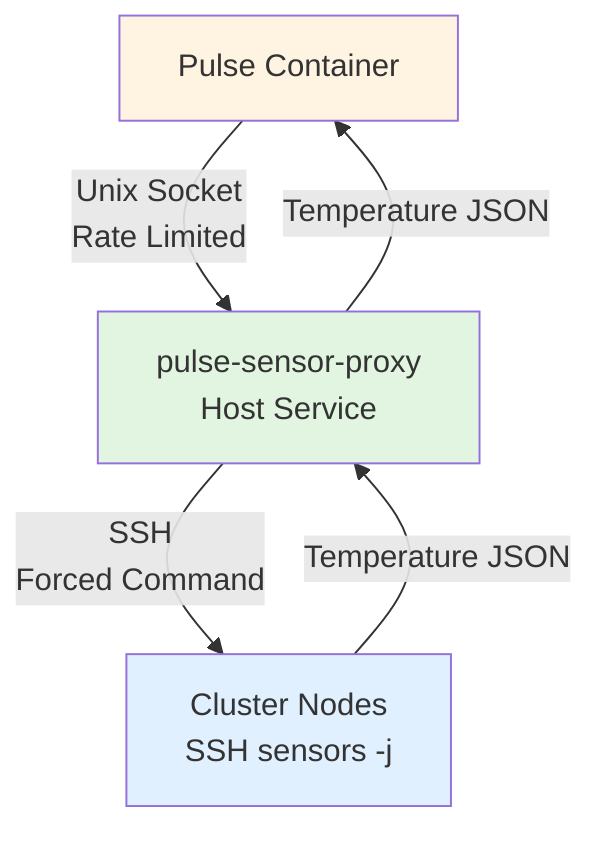

# Temperature Monitoring Security Guide

This document describes the security architecture of Pulse's temperature monitoring system with pulse-sensor-proxy.

## Table of Contents
- [Architecture Overview](#architecture-overview)
- [Security Boundaries](#security-boundaries)
- [Authentication & Authorization](#authentication--authorization)
- [Rate Limiting](#rate-limiting)
- [SSH Security](#ssh-security)
- [Container Isolation](#container-isolation)
- [Monitoring & Alerting](#monitoring--alerting)
- [Development Mode](#development-mode)
- [Troubleshooting](#troubleshooting)

---

## Architecture Overview



**Key Principle**: SSH keys never enter containers. All SSH operations are performed by the host-side proxy.

---

## Security Boundaries

### 1. Host ↔ Container Boundary
- **Enforced by**: Method-level authorization + ID-mapped root detection
- **Container CAN**:
  - ✅ Call `get_temperature` (read temperature data)
  - ✅ Call `get_status` (check proxy health)
- **Container CANNOT**:
  - ❌ Call `ensure_cluster_keys` (SSH key distribution)
  - ❌ Call `register_nodes` (node discovery)
  - ❌ Call `request_cleanup` (cleanup operations)
  - ❌ Use direct SSH (blocked by container detection)

### 2. Proxy ↔ Cluster Nodes Boundary
- **Enforced by**: SSH forced commands + IP filtering
- **SSH authorized_keys entry**:
```bash
from="192.168.0.0/24",command="sensors -j",no-port-forwarding,no-X11-forwarding,no-agent-forwarding,no-pty ssh-ed25519 AAAA... pulse-sensor-proxy
```
- Proxy can ONLY run `sensors -j` on cluster nodes
- IP restrictions prevent lateral movement

### 3. Client ↔ Proxy Boundary
- **Enforced by**: UID-based ACL + adaptive rate limiting
- SO_PEERCRED verifies caller's UID/GID/PID
- Rate limiting (defaults): ~12 requests per minute per UID (burst 2), per-UID concurrency 2, global concurrency 8, 2 s penalty on validation failures
- Per-node guard: only 1 SSH fetch per node at a time

---

## Authentication & Authorization

### Authentication (Who can connect?)

**Allowed UIDs**:
- Root (UID 0) - host processes
- Proxy's own UID (pulse-sensor-proxy user)
- Configured UIDs from `/etc/pulse-sensor-proxy/config.yaml`
- ID-mapped root ranges (containers, if enabled)

**ID-Mapped Root Detection**:
- Reads `/etc/subuid` and `/etc/subgid` for UID/GID mapping ranges
- Containers typically use ranges like `100000-165535`
- Both UID AND GID must be in mapped ranges

### Authorization (What can they call?)

**Privileged Methods** (host-only):
```go
var privilegedMethods = map[string]bool{
    "ensure_cluster_keys": true,  // SSH key distribution
    "register_nodes":      true,  // Node registration
    "request_cleanup":     true,  // Cleanup operations
}
```

**Authorization Check**:
```go
if privilegedMethods[method] && isIDMappedRoot(credentials) {
    return "method requires host-level privileges"
}
```

**Read-Only Methods** (containers allowed):
- `get_temperature` - Fetch temperature data via proxy
- `get_status` - Check proxy health and version

---

## Rate Limiting

### Per-Peer Limits
- **Rate**: ~12 requests per minute (`rate.Every(5s)`)
- **Burst**: 2 requests (short spikes are tolerated)
- **Per-peer concurrency**: Maximum 2 simultaneous RPCs
- **Global concurrency**: 8 total in-flight RPCs across all peers
- **Penalty**: 2 s enforced delay when validation fails (payloads too large, unauthorized methods)
- **Cleanup**: Idle peer entries removed after 10 minutes

### Per-Node Concurrency
- **Limit**: 1 concurrent SSH request per node
- **Purpose**: Prevents SSH connection storms
- **Scope**: Applies to all peers requesting same node

### Monitoring Rate Limits
```bash
# Check rate limit metrics
curl -s http://127.0.0.1:9127/metrics | grep pulse_proxy_limiter_rejects_total

# Watch for rate limit warnings in logs
journalctl -u pulse-sensor-proxy -f | grep "Rate limit exceeded"
```

---

## SSH Security

### SSH Key Management

**Key Location**: `/var/lib/pulse-sensor-proxy/ssh/id_ed25519`
- **Owner**: `pulse-sensor-proxy:pulse-sensor-proxy`
- **Permissions**: `0600` (read/write for owner only)
- **Type**: Ed25519 (modern, secure)

**Key Distribution**:
- Only host processes can trigger distribution (via `ensure_cluster_keys`)
- Containers are blocked from key distribution operations
- Keys are distributed with forced commands and IP restrictions

### Forced Command Restrictions

**On cluster nodes**, the SSH key can ONLY run:
```bash
sensors -j
```

**No other commands possible**:
- ❌ Shell access denied (`no-pty`)
- ❌ Port forwarding disabled (`no-port-forwarding`)
- ❌ X11 forwarding disabled (`no-X11-forwarding`)
- ❌ Agent forwarding disabled (`no-agent-forwarding`)

### IP Filtering

**Source IP restrictions**:
```bash
from="192.168.0.0/24,10.0.0.0/8"
```
- Automatically detected from cluster node IPs
- Prevents SSH key use from outside the cluster
- Updated during key rotation

---

## Container Isolation

### Fallback SSH Protection

**In containers**, direct SSH is blocked:
```go
if isRunningInContainer() && !devModeAllowSSH {
    log.Error().Msg("SECURITY BLOCK: SSH temperature collection disabled in containers")
    return &Temperature{Available: false}, nil
}
```

**Container Detection Methods**:
1. Check for `/.dockerenv` file
2. Check `/proc/1/cgroup` for "docker", "lxc", "containerd"

**Bypass**: Only possible with explicit environment variable (see [Development Mode](#development-mode))

### ID-Mapped Root Detection

**How it works**:
```go
// Check /etc/subuid and /etc/subgid for mapping ranges
// Example /etc/subuid:
//   root:100000:65536

func isIDMappedRoot(cred *peerCredentials) bool {
    return uidInRange(cred.uid, idMappedUIDRanges) &&
           gidInRange(cred.gid, idMappedGIDRanges)
}
```

**Why both UID and GID?**:
- Container root: `uid=100000, gid=100000` → ID-mapped
- Container app user: `uid=101001, gid=101001` → ID-mapped
- Host root: `uid=0, gid=0` → NOT ID-mapped
- Mixed: `uid=100000, gid=50` → NOT ID-mapped (fails check)

---

## Monitoring & Alerting

### Log Locations

**Proxy logs**:
```bash
journalctl -u pulse-sensor-proxy -f
```

**Backend logs** (inside container):
```bash
journalctl -u pulse-backend -f
```

**Audit rotation**: Use the steps in [operations/audit-log-rotation.md](operations/audit-log-rotation.md) to rotate `/var/log/pulse/sensor-proxy/audit.log`. After each rotation, restart the proxy and confirm temperature pollers are healthy in `/api/monitoring/scheduler/health` (closed breakers, no DLQ entries).

### Security Events to Monitor

#### 1. Privileged Method Denials
```
SECURITY: Container attempted to call privileged method - access denied
method=ensure_cluster_keys uid=101000 gid=101000 pid=12345
```

**Alert on**: Any occurrence (indicates attempted privilege escalation)

#### 2. Rate Limit Violations
```
Rate limit exceeded uid=101000 pid=12345
```

**Alert on**: Sustained violations (>10/minute indicates possible abuse)

#### 3. Authorization Failures
```
Peer authorization failed uid=50000 gid=50000
```

**Alert on**: Repeated failures from same UID (indicates misconfiguration or probing)

#### 4. SSH Fallback Attempts
```
SECURITY BLOCK: SSH temperature collection disabled in containers
```

**Alert on**: Any occurrence (should only happen during misconfigurations)

### Metrics to Track

```bash
# Rate limit hits
pulse_proxy_rate_limit_hits_total

# RPC requests by method and result
pulse_proxy_rpc_requests_total{method="get_temperature",result="success"}
pulse_proxy_rpc_requests_total{method="ensure_cluster_keys",result="unauthorized"}

# SSH request latency
pulse_proxy_ssh_latency_seconds{node="delly"}

# Active connections
pulse_proxy_queue_depth
pulse_proxy_global_concurrency_inflight
```

### Recommended Alerts

1. **Privilege Escalation Attempts**:
   ```
   pulse_proxy_rpc_requests_total{result="unauthorized"} > 0
   ```

2. **Rate Limit Abuse**:
   ```
   rate(pulse_proxy_rate_limit_hits_total[5m]) > 1
   ```

3. **Proxy Unavailable**:
   ```
   up{job="pulse-sensor-proxy"} == 0
   ```

4. **Scheduler Drift** (Pulse side – ensures temperature pollers stay healthy):
   ```
   max_over_time(pulse_monitor_poll_queue_depth[5m]) > <baseline*1.5>
   ```
   Pair with a check of `/api/monitoring/scheduler/health` to confirm temperature instances report `breaker.state == "closed"`.

---

## Development Mode

### SSH Fallback Override

**Purpose**: Allow direct SSH from containers during development/testing

**Environment Variable**:
```bash
export PULSE_DEV_ALLOW_CONTAINER_SSH=true
```

**Security Implications**:
- ⚠️ **NEVER use in production**
- Allows container to use SSH keys if present
- Defeats the security isolation model
- Should only be used in trusted development environments

**Example Usage**:
```bash
# In systemd override for pulse-backend
mkdir -p /etc/systemd/system/pulse-backend.service.d
cat <<EOF > /etc/systemd/system/pulse-backend.service.d/dev-ssh.conf
[Service]
Environment=PULSE_DEV_ALLOW_CONTAINER_SSH=true
EOF
systemctl daemon-reload
systemctl restart pulse-backend
```

**Monitoring**:
```bash
# Check if dev mode is active
journalctl -u pulse-backend | grep "dev mode" | tail -1
```

**Disable dev mode**:
```bash
rm /etc/systemd/system/pulse-backend.service.d/dev-ssh.conf
systemctl daemon-reload
systemctl restart pulse-backend
```

---

## Troubleshooting

### "method requires host-level privileges"

**Symptom**: Container gets this error when calling RPC

**Cause**: Container attempted to call privileged method

**Resolution**: This is expected behavior. Only these methods are restricted:
- `ensure_cluster_keys`
- `register_nodes`
- `request_cleanup`

**If host process is blocked**:
1. Check UID is not in ID-mapped range:
   ```bash
   id
   cat /etc/subuid /etc/subgid
   ```

2. Verify proxy's allowed UIDs:
   ```bash
   cat /etc/pulse-sensor-proxy/config.yaml
   ```

### "Rate limit exceeded"

**Symptom**: Requests failing with rate limit error

**Cause**: Peer exceeded ~12 requests/minute (or exhausted per-peer/global concurrency)

**Resolution**:
1. Confirm workload is legitimate (look for retry loops or aggressive polling).
2. Allow the limiter to recover—penalty sleeps clear in ~2 s and idle peers expire after 10 minutes.
3. If sustained higher throughput is required, adjust the constants in `cmd/pulse-sensor-proxy/throttle.go` and rebuild.

### Temperature monitoring unavailable

**Symptom**: No temperature data in dashboard

**Diagnosis**:
```bash
# 1. Check proxy is running
systemctl status pulse-sensor-proxy

# 2. Check socket exists
ls -la /run/pulse-sensor-proxy/

# 3. Check socket is accessible in container
ls -la /mnt/pulse-proxy/

# 4. Test proxy from host
curl -s --unix-socket /run/pulse-sensor-proxy/pulse-sensor-proxy.sock \
  -X POST -d '{"method":"get_status"}' | jq

# 5. Check SSH connectivity
ssh root@delly "sensors -j"

# 6. Inspect adaptive polling for temperature pollers
curl -s http://localhost:7655/api/monitoring/scheduler/health \
  | jq '.instances[] | select(.key | contains("temperature")) | {key, breaker: .breaker.state, deadLetter: .deadLetter.present, lastSuccess: .pollStatus.lastSuccess}'
```

### SSH key not distributed

**Symptom**: Manual `ensure_cluster_keys` call fails

**Check**:
1. Are you calling from host (not container)?
2. Is pvecm available? `command -v pvecm`
3. Can you reach cluster nodes? `pvecm status`
4. Check proxy logs: `journalctl -u pulse-sensor-proxy -f`

---

## Best Practices

### Production Deployments

1. ✅ **Never use dev mode** (`PULSE_DEV_ALLOW_CONTAINER_SSH=true`)
2. ✅ **Monitor security logs** for unauthorized access attempts
3. ✅ **Use IP filtering** on SSH authorized_keys entries
4. ✅ **Rotate SSH keys** periodically (use `ensure_cluster_keys` with rotation)
5. ✅ **Limit allowed_peer_uids** to minimum necessary
6. ✅ **Enable audit logging** for privileged operations

### Development Environments

1. ✅ Use dev mode SSH override if needed (document why)
2. ✅ Test with actual ID-mapped containers
3. ✅ Verify privileged method blocking works
4. ✅ Test rate limiting under load

### Incident Response

**If container compromise suspected**:

1. Check for privileged method attempts:
   ```bash
   journalctl -u pulse-sensor-proxy | grep "SECURITY:"
   ```

2. Check rate limit violations:
   ```bash
   journalctl -u pulse-sensor-proxy | grep "Rate limit"
   ```

3. Restart proxy to clear state:
   ```bash
   systemctl restart pulse-sensor-proxy
   ```

4. Consider rotating SSH keys:
   ```bash
   # From host, call ensure_cluster_keys with new key
   ```

---

## References

- [Pulse Installation Guide](../README.md)
- [pulse-sensor-proxy Configuration](../cmd/pulse-sensor-proxy/README.md)
- [Security Audit Results](../SECURITY.md)
- [LXC ID Mapping Documentation](https://linuxcontainers.org/lxc/manpages/man5/lxc.container.conf.5.html#lbAJ)

---

**Last Updated**: 2025-10-19
**Security Contact**: File issues at https://github.com/rcourtman/Pulse/issues
