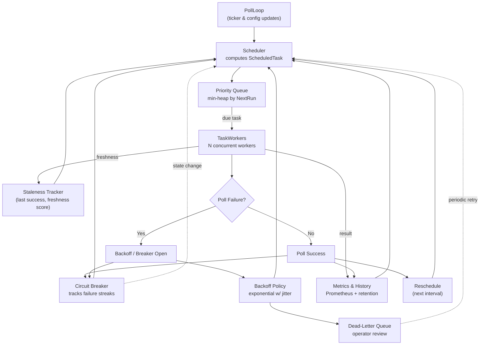
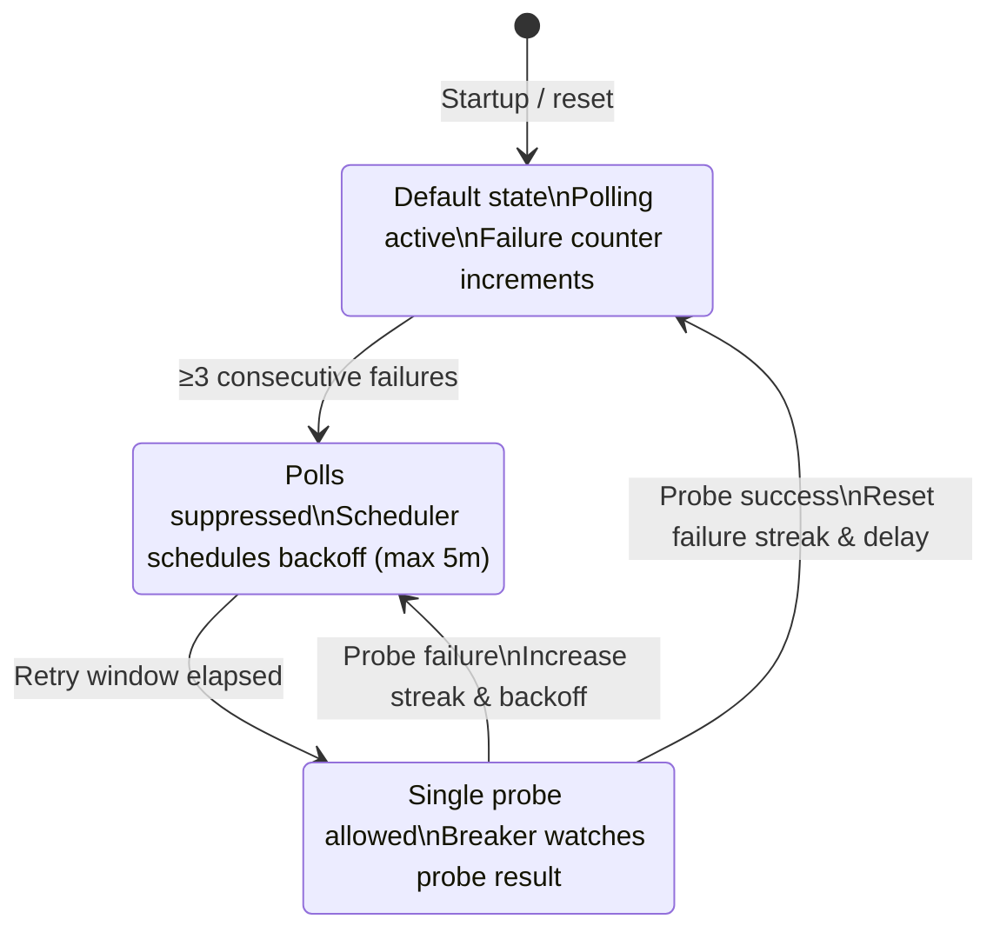

# Adaptive Polling Architecture

## Overview
Phase 2 introduces a scheduler that adapts poll cadence based on freshness, errors, and workload. The goal is to prioritize stale or changing instances while backing off on healthy, idle targets.



- **Scheduler** computes `ScheduledTask` entries using adaptive intervals.
- **Task queue** is a min-heap keyed by `NextRun`; only due tasks execute.
- **Workers** execute tasks, capture outcomes, reschedule via scheduler or backoff logic.

## Key Components

| Component             | File                                      | Responsibility                                               |
|-----------------------|-------------------------------------------|--------------------------------------------------------------|
| Scheduler             | `internal/monitoring/scheduler.go`        | Calculates adaptive intervals per instance.                 |
| Staleness tracker     | `internal/monitoring/staleness_tracker.go`| Maintains freshness metadata and scores.                    |
| Priority queue        | `internal/monitoring/task_queue.go`       | Orders `ScheduledTask` items by due time + priority.        |
| Circuit breaker       | `internal/monitoring/circuit_breaker.go`  | Trips on repeated failures, preventing hot loops.           |
| Backoff               | `internal/monitoring/backoff.go`          | Exponential retry delays with jitter.                       |
| Workers               | `internal/monitoring/monitor.go`          | Pop tasks, execute pollers, reschedule or dead-letter.      |

## Configuration

**v4.24.0:** Adaptive polling is **enabled by default** but can be toggled without restart.

### Via UI
Navigate to **Settings → System → Monitoring** to enable/disable adaptive polling. Changes apply immediately without requiring a restart.

### Via Environment Variables
Environment variables (default in `internal/config/config.go`):

| Variable                            | Default | Description                                      |
|-------------------------------------|---------|--------------------------------------------------|
| `ADAPTIVE_POLLING_ENABLED`          | true    | **Changed in v4.24.0**: Now enabled by default   |
| `ADAPTIVE_POLLING_BASE_INTERVAL`    | 10s     | Target cadence when system is healthy            |
| `ADAPTIVE_POLLING_MIN_INTERVAL`     | 5s      | Lower bound (active instances)                   |
| `ADAPTIVE_POLLING_MAX_INTERVAL`     | 5m      | Upper bound (idle instances)                     |

All settings persist in `system.json` and respond to environment overrides. **Changes apply without restart** when modified via UI.

## Metrics

**v4.24.0:** Extended metrics for comprehensive monitoring.

Exposed via Prometheus (`:9091/metrics`):

| Metric                                      | Type      | Labels                                | Description                                     |
|---------------------------------------------|-----------|---------------------------------------|-------------------------------------------------|
| `pulse_monitor_poll_total`                  | counter   | `instance_type`, `instance`, `result` | Overall poll attempts (success/error)           |
| `pulse_monitor_poll_duration_seconds`       | histogram | `instance_type`, `instance`           | Poll latency per instance                       |
| `pulse_monitor_poll_staleness_seconds`      | gauge     | `instance_type`, `instance`           | Age since last success (0 on success)           |
| `pulse_monitor_poll_queue_depth`            | gauge     | —                                     | Size of priority queue                          |
| `pulse_monitor_poll_inflight`               | gauge     | `instance_type`                       | Concurrent tasks per type                       |
| `pulse_monitor_poll_errors_total`           | counter   | `instance_type`, `instance`, `category` | **New in v4.24.0**: Error counts by category (transient/permanent) |
| `pulse_monitor_poll_last_success_timestamp` | gauge     | `instance_type`, `instance`           | **New in v4.24.0**: Unix timestamp of last successful poll |

**Alerting Recommendations:**
- Alert when `pulse_monitor_poll_staleness_seconds` > 120 for critical instances
- Alert when `pulse_monitor_poll_queue_depth` > 50 (backlog building)
- Alert when `pulse_monitor_poll_errors_total` with `category=permanent` increases (auth/config issues)

## Circuit Breaker & Backoff

| State       | Trigger                                     | Recovery                                   |
|-------------|---------------------------------------------|--------------------------------------------|
| **Closed**  | Default. Failures counted.                  | —                                          |
| **Open**    | ≥3 consecutive failures. Poll suppressed.   | Exponential delay (max 5 min).             |
| **Half-open**| Retry window elapsed. Limited re-attempt. | Success ⇒ closed. Failure ⇒ open.         |



Backoff configuration:

- Initial delay: 5 s
- Multiplier: x2 per failure
- Jitter: ±20 %
- Max delay: 5 minutes
- After 5 transient failures or any permanent failure, task moves to dead-letter queue for operator action.

## Dead-Letter Queue

Dead-letter entries are kept in memory (same `TaskQueue` structure) with a 30 min recheck interval. Operators should inspect logs for `Routing task to dead-letter queue` messages. Future work (Task 8) will add API surfaces for inspection.

## API Endpoints

### GET /api/monitoring/scheduler/health

Returns comprehensive scheduler health data (authentication required).

**Response format:**

```json
{
  "updatedAt": "2025-03-21T18:05:00Z",
  "enabled": true,
  "queue": {
    "depth": 7,
    "dueWithinSeconds": 2,
    "perType": {
      "pve": 4,
      "pbs": 2,
      "pmg": 1
    }
  },
  "deadLetter": {
    "count": 2,
    "tasks": [
      {
        "instance": "pbs-nas",
        "type": "pbs",
        "nextRun": "2025-03-21T18:25:00Z",
        "lastError": "connection timeout",
        "failures": 7
      }
    ]
  },
  "breakers": [
    {
      "instance": "pve-core",
      "type": "pve",
      "state": "half_open",
      "failures": 3,
      "retryAt": "2025-03-21T18:05:45Z"
    }
  ],
  "staleness": [
    {
      "instance": "pve-core",
      "type": "pve",
      "score": 0.12,
      "lastSuccess": "2025-03-21T18:04:50Z"
    }
  ]
}
```

**Field descriptions:**

- `enabled`: Feature flag status
- `queue.depth`: Total queued tasks
- `queue.dueWithinSeconds`: Tasks due within 12 seconds
- `queue.perType`: Distribution by instance type
- `deadLetter.count`: Total dead-letter tasks
- `deadLetter.tasks`: Up to 25 most recent dead-letter entries
- `breakers`: Circuit breaker states (only non-default states shown)
- `staleness`: Freshness scores per instance (0 = fresh, 1 = max stale)

## Operational Guidance

1. **Enable adaptive polling**: set `ADAPTIVE_POLLING_ENABLED=true` via UI or environment overrides, then restart hot-dev (`scripts/hot-dev.sh`).
2. **Monitor metrics** to ensure queue depth and staleness remain within SLA. Configure alerting on `poll_staleness_seconds` and `poll_queue_depth`.
3. **Inspect scheduler health** via API endpoint `/api/monitoring/scheduler/health` for circuit breaker trips and dead-letter queue status.
4. **Review dead-letter logs** for persistent failures; resolve underlying connectivity or auth issues before re-enabling.

## Rollout Plan

1. **Dev/QA**: Run hot-dev with feature flag enabled; observe metrics and logs for several cycles.
2. **Staged deploy**: Enable flag on a subset of clusters; monitor queue depth (<50) and staleness (<45 s).
3. **Full rollout**: Toggle flag globally once metrics are stable; document any overrides in release notes.
4. **Post-launch**: Add Grafana panels for queue depth & staleness; alert on circuit breaker trips (future API work).

## Known Follow-ups

- Task 8: expose scheduler health & dead-letter statistics via API and UI panels.
- Task 9: add dedicated unit/integration harness for the scheduler & workers.

