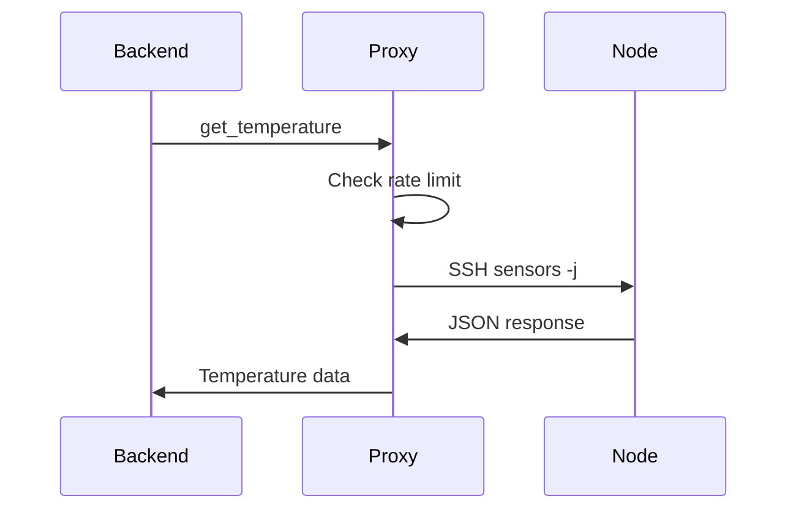

# Pulse Sensor Proxy Runbook

## Quick Reference
- Binary: `/opt/pulse/sensor-proxy/bin/pulse-sensor-proxy`
- Unit: `pulse-sensor-proxy.service`
- Logs: `/var/log/pulse/sensor-proxy/proxy.log`
- Audit trail: `/var/log/pulse/sensor-proxy/audit.log` (hash chained, forwarded via rsyslog)
- Metrics: `http://127.0.0.1:9127/metrics` (set `PULSE_SENSOR_PROXY_METRICS_ADDR` to change/disable)
- Limiters: ~12 requests/minute per UID (burst 2), per-UID concurrency 2, global concurrency 8, 2 s penalty on validation failures

## Monitoring Alerts & Response



### Rate Limit Hits (`pulse_proxy_limiter_rejections_total`)
1. Check audit log entries tagged `limiter.rejection` for offending UID.
2. Confirm workload legitimacy; if expected, consider increasing limits via config override.
3. If malicious, block source process/user and inspect Pulse audit logs.

### Penalty Events (`pulse_proxy_limiter_penalties_total`)
1. Review corresponding validation failures in audit log (`command.validation_failed`).
2. If repeated invalid JSON/unknown methods, inspect caller code for regressions or intrusion attempts.

### Audit Log Forwarder Down
1. `journalctl -u rsyslog` to confirm transmission errors.
2. Ensure `/etc/pulse/log-forwarding` certs valid & remote host reachable.
3. Forwarding queue stored locally in `/var/log/pulse/sensor-proxy/forwarding.log`; ship manually if outage exceeds 1 hour.

### Proxy Health Endpoint Fails
1. `systemctl status pulse-sensor-proxy`
2. Check `/var/log/pulse/sensor-proxy/proxy.log` for panic or limiter exhaustion.
3. Inspect `/var/log/pulse/sensor-proxy/audit.log` for recent privileged method denials.

## Standard Procedures
### Restart Proxy Safely
```bash
sudo systemctl stop pulse-sensor-proxy
sudo apparmor_parser -r /etc/apparmor.d/pulse-sensor-proxy   # if updating policy
sudo systemctl start pulse-sensor-proxy
```
Verify:
```bash
# Metrics endpoint exposes proxy build/health
curl -s http://127.0.0.1:9127/metrics | grep pulse_proxy_build_info

# Ensure adaptive polling sees the proxy again
curl -s http://localhost:7655/api/monitoring/scheduler/health \
  | jq '.instances[] | select(.key | contains("temperature")) | {key, pollStatus}'
```
Temperature instances should show recent `lastSuccess` timestamps with no DLQ entries.

### Rotate SSH Keys
1. Run `scripts/secure-sensor-files.sh` to regenerate keys (ensure environment locked down).
2. Use RPC `ensure_cluster_keys` to distribute new public key.
3. Confirm nodes accept `ssh` from proxy host.
4. Confirm the scheduler clears any temporary breakers/dlq entries:
   ```bash
   curl -s http://localhost:7655/api/monitoring/scheduler/health \
     | jq '.instances[] | select(.key | contains("temperature")) | {key, breaker: .breaker.state, deadLetter: .deadLetter.present}'
   ```
   Expect `breaker.state=="closed"` and `deadLetter.present==false` for all proxy-driven pollers.

### Adjust Rate Limits
1. Update `limiter_policy` environment overrides (future config).
2. Restart proxy; monitor limiter metrics to validate new thresholds.
3. Document change in security runbook.

## Incident Handling
- **Unauthorized Command Attempt:** audit log shows `command.validation_failed` and limiter penalties; capture correlation ID, check Pulse side for compromised container.
- **Excessive Temperature Failures:** refer to `pulse_proxy_ssh_requests_total{result="error"}`; validate network ACLs and node health; escalate to Proxmox team if nodes unreachable.
- **Log Tampering Suspected:** verify audit hash chain by replaying `eventHash` values; compare with remote log store (immutable). Trigger security response if mismatch.

## Postmortem Checklist
- Timeline: command audit entries, limiter stats, rsyslog queue depth.
- Verify AppArmor/seccomp status (`aa-status`, `systemctl show pulse-sensor-proxy -p AppArmorProfile`).
- Ensure firewall ACLs match `docs/security/pulse-sensor-proxy-network.md`.
