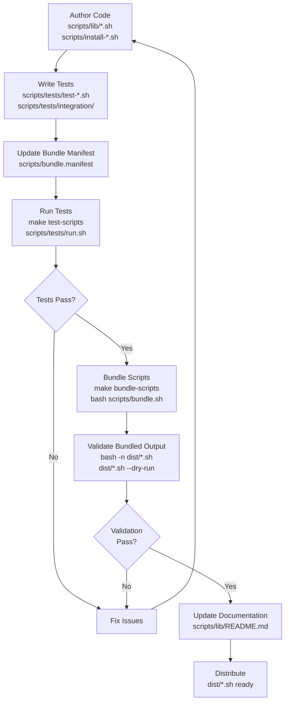

# Script Library Guide

## 1. Introduction

The script library system standardises helper functions used across Pulse
installers. It reduces duplication, improves testability, and makes it easier to
roll out fixes across the installer fleet. Use the shared libraries when:

- Multiple scripts need the same functionality (logging, HTTP, systemd, etc.).
- You are refactoring legacy scripts to adopt the v2 pattern.
- New features require reusable helpers (e.g., additional service management).

## 2. Architecture Overview

```
scripts/
├── lib/                     # Shared library modules
│   ├── common.sh           # Core utilities
│   ├── systemd.sh          # Service management
│   ├── http.sh             # HTTP/API operations
│   └── README.md           # API documentation
├── tests/                  # Test suites
│   ├── run.sh              # Test runner
│   ├── test-*.sh           # Smoke tests
│   └── integration/        # Integration tests
├── bundle.sh               # Bundler tool
├── bundle.manifest         # Bundle configuration
└── install-*.sh            # Installer scripts

dist/                       # Generated bundled scripts
└── install-*.sh            # Ready for distribution
```

### Development & Bundling Workflow



This workflow emphasizes the library's modular design: develop reusable modules in `scripts/lib`, test thoroughly, bundle for distribution, and validate bundled artifacts before release.

## 3. Using the Library in Your Script

```bash
#!/usr/bin/env bash
# Example installer using shared libraries

LIB_DIR="$(cd "$(dirname "${BASH_SOURCE[0]}" )" && pwd)/lib"
if [[ -f "$LIB_DIR/common.sh" ]]; then
    source "$LIB_DIR/common.sh"
    source "$LIB_DIR/systemd.sh"
    source "$LIB_DIR/http.sh"
fi

common::init "$@"

main() {
    common::ensure_root --allow-sudo --args "$@"
    common::log_info "Starting installation..."
    # ...script logic...
}

main "$@"
```

## 4. Common Migration Patterns

**Logging**
```bash
# Before
echo "[INFO] Installing..."

# After
common::log_info "Installing..."
```

**Privilege Escalation**
```bash
# Before
if [[ $EUID -ne 0 ]]; then
  echo "Must run as root"; exit 1
fi

# After
common::ensure_root --allow-sudo --args "$@"
```

**Downloads**
```bash
# Before
curl -o file.tar.gz http://example.com/file.tar.gz

# After
http::download --url http://example.com/file.tar.gz --output file.tar.gz
```

**Systemd Unit Creation**
```bash
# Before
cat > /etc/systemd/system/my.service <<'EOF'
...
systemctl daemon-reload
systemctl enable my.service
systemctl start my.service

# After
systemd::create_service /etc/systemd/system/my.service <<'EOF'
...
EOF
systemd::enable_and_start "my.service"
```

## 5. Creating New Library Modules

Create a new module when functionality is reused across scripts or complex
enough to warrant dedicated helpers. Template:

```bash
#!/usr/bin/env bash
# Module: mymodule.sh

mymodule::do_thing() {
    local arg="$1"
    # implementation
}
```

Add the module to `scripts/lib`, document exported functions in
`scripts/lib/README.md`, and update `scripts/bundle.manifest` for any bundles
that need it.

## 6. Testing Requirements

Every migrated script must include:

1. Smoke test (`scripts/tests/test-<script>.sh`) covering syntax and core flows.
2. Integration test (when the script modifies system state or talks to services).
3. Successful execution of `scripts/tests/run.sh` and relevant integration tests.

Example smoke test:

```bash
#!/usr/bin/env bash
set -euo pipefail

SCRIPT="scripts/my-script.sh"
bash -n "$SCRIPT"
output="$($SCRIPT --dry-run 2>&1)"
[[ -n "$output" ]] || exit 1
echo "All my-script tests passed"
```

## 7. Bundling for Distribution

1. Update `scripts/bundle.manifest` with the module order.
2. Run `make bundle-scripts` or `bash scripts/bundle.sh`.
3. Validate outputs: `bash -n dist/my-installer.sh` and `dist/my-installer.sh --dry-run`.

## 8. Code Style Guidelines

- Namespace exported functions (`module::function`).
- Use `common::` helpers whenever applicable.
- Quote variables, prefer `[[ ]]` over `[ ]`.
- Keep shellcheck clean (`make lint-scripts`).
- Internal helpers can use `_module::` or nested `local` functions.

## 9. Migration Checklist

- [ ] Create v2 script alongside legacy version.
- [ ] Source shared modules and call `common::init`.
- [ ] Replace manual logging/privilege escalation with library calls.
- [ ] Extract reusable helpers into modules.
- [ ] Add `--dry-run` support.
- [ ] Write/update smoke and integration tests.
- [ ] Update bundle manifest and regenerate bundles.
- [ ] Validate bundled artifacts.
- [ ] Refresh documentation and release notes.
- [ ] Provide before/after metrics in PR.

## 10. Common Pitfalls

- Modifying shared modules for a single script — create script-specific helpers.
- Forgetting to update bundle manifest or regenerate bundles.
- Skipping tests (smoke/integration) before submitting PRs.
- Hardcoding paths; prefer variables and configurable directories.
- Breaking backwards compatibility without a rollout plan.

## 11. Examples

- `scripts/install-docker-agent-v2.sh` — complete migration example.
- `scripts/lib/README.md` — full API reference.
- `scripts/tests/test-docker-agent-v2.sh` — smoke test pattern.
- `scripts/tests/integration/test-docker-agent-install.sh` — integration setup.

## 12. Getting Help

- Review existing modules in `scripts/lib` before adding new helpers.
- Run `scripts/tests/run.sh` (smoke) and relevant integration tests.
- Use `make lint-scripts` to catch style issues early.
- Ask in GitHub Discussions or internal Slack with context & logs when blocked.
